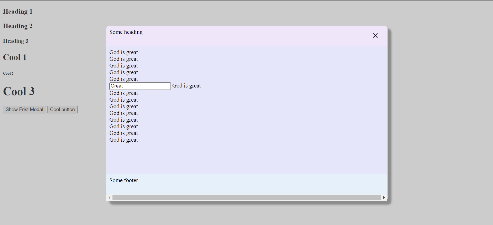

# Introduction
•	This is a small, fast, and easy-to-use JavaScript library. \
•	The purpose behind creating this library is to simplify complex tasks like Ajax, HTML document traversal and manipulation, event handling, and form validation.
# Features
•	List of key features:\
•	Simplifies Ajax requests.\
•	Facilitates HTML document traversal and manipulation.\
•	Streamlines event handling.\
•	Provides tools for form validation.
# Getting Started
Download the JSRock.js and styles.css file\
Include this files in your code using script and link tag
```
<script src=’js/JSRock.js’></script>
<link rel=’stylesheet’ href=’css/styles.css’>

```
# Usage
## Ajax Requests
#### 1.	Sending GET type request without data
```
function populateDesignations()
{
$$$.ajax({
“url” : “getDesignations”,
“methodType” : “GET”,
“success” : function(responseData){
fillComboBox(JSON.parse(responseData));
},
“failure” : function(){
alert(“Opps something went wrong, please try again later”);
}
});
}
```
The ajax function facilitates the initiation of Ajax requests. It expects a JSON object as an argument. This JSON object should contain the following properties:\
**url:** Specifies the target URL for the request.\
**methodType:** Can be either GET or POST\
**success:** A callback function triggered upon a successful request. It receives one argument, namely the data returned from the server side.\
**failure:** A callback function activated in case of a failed request.
#### 2.	GET type request with data
```
$$$.ajax({
“url” : “getData”,
“methodType” : “GET”,
“data” : {
“code” : code
},
“success” : function(responseData){
},
“failure” : function(){}
});
```
**data** : Data to be sent to the server.
#### 3.	POST Type request without data
```
$$$.ajax({
“url” : “getData”,
“methodType” : “POST”,
“success” : function(responseData){},
“failure” : function(){}
});
```
#### 4.	POST Type request with data
```
$$$.ajax({
“url” : “getData”,
“methodType” : “GET”,
“data” : someData,
“sendJSON” : true,
“success” : function(responseData){
},
“failure” : function(){
}
});
```
**sendJSON** : When sendJSON is set to true then the data will be sent in the form of JSON object. Alternatively the data will be encoded in query string format and then sent to the server

## Fill combo box
```
$$$(“comboBox_id”).fillComboBox(obj);
obj : JSON Object
How to use : 
$$$(“comboBox_id”).fillComboBox({
“dataSource” : data,
“text” : “city”,
“value” : “code”,
“firstOption” : {
“text” : “<select city>”,
“value” : -1
}
});
```
**dataSource:** (Required)\
The data used to populate the combo box. It can be an array.\
**text:** (Required)\
The name of the property in the dataSource object whose value is to be set as the text attribute of the option tag.\
**value:** (Required)\
The name of the property in the dataSource object whose value is to be set as the value attribute of the option tag.\
**firstOption:** (Optional)\
The first option to be displayed in the combo box. This option will be selected by default.
## Accordian Pane
```
<script>
$$$.onDocumentLoaded(function(){
$$$.toAccordian("accord1");
});
</script>
</head>
<body>
<div id=”accord1”>
<h3>Heading 1</h3>
<div>
1 whatever whatever
2 whatever whatever
3 whatever whatever
4 whatever whatever
5 whatever whatever
6 whatever whatever
7 whatever whatever
</div>

<h3>Heading 2</h3>
<div>
11 whatever whatever
22 whatever whatever
33 whatever whatever
44 whatever whatever
55 whatever whatever
66 whatever whatever
77 whatever whatever
</div>

<h4>Heading 3</h4>
<div>
111 whatever whatever
222 whatever whatever
333 whatever whatever
444 whatever whatever
555 whatever whatever
666 whatever whatever
777 whatever whatever
</div>
</div>
<div id='accord2' accordian=’true’>
<h2>Cool 1</h2>
<div>
1 Cool cool
2  Cool cool
3  Cool cool
4  Cool cool
</div>
<h6>Cool 2</h6>
<div>
11 Cool cool
22 Cool cool
33 Cool cool
44 Cool cool
55 Cool cool
66 Cool cool
</div>
<h1>Cool 3</h1>
<div>
111 Cool cool
222 Cool cool
333 Cool cool
444 Cool cool
555 Cool cool
</div>
</div>
</body>
```
**Output :** 

## Creating modal
```
<script>
function abBeforeOpening()
{
alert("Modal with ab is about to be opened");
return true;
}
function abOpened()
{
alert("Modal with ab opened");
}
function abBeforeClosing()
{
alert("Modal with ab is about to be closed");
return true;
}
function abClosed()
{
alert("Modal with ab closed");
}
function createModal1()
{
$$$.modals.show("modal1");
} 
</script>
</head>
<body>
<button onclick='createModal1()'>Show First Modal</button>
<div id='modal1' style='display:none' forModal='true' size="750x400" header="Some heading" footer="Some footer" maskColor="#808080" modalBackgroundColor="#E6E6FA" closeButton="true" 
beforeOpening="abBeforeOpening()"
afterOpening="abOpened()"
beforeClosing="abBeforeClosing()"
afterClosing="abClosed()">
God is great<br>
God is great<br>
God is great<br>
God is great<br>
God is great<br>
God is great<br>
God is great<br>
God is great<br>
God is great<br>
God is great<br>
God is great<br>
God is great<br>
God is great<br>
God is great<br>
</div>
<button onclick='xyz()'>Cool button</button>
</body>
```
**Output :**

 

**$$$.modals.show(modal_id) :** Call this function to display a modal. The function takes the ID of the element to be converted into a modal as an argument.

**forModal :** (Optional)

Specify this as true if the modal element is intended to exist outside of the DOM, solely for presentation within the modal interface.

**size** : (Optional)

The desired size of modal can be specified against the size attribute in the following formate : width x height

**header** : (Optional)

To display header in the modal use this attribute.

**footer** : (Optional)

To display footer in the modal use this attribute.

**maskColor** : (Optional)

Use this attribute to specify background color of the modal window .

**modalBackgroundColor** : (Optional)

Use this attribute to specify the color of the modal window.

**closeButton** : (Optional)

Set this attribute true if a close button is intended to be displayed on the modal. By default this attribute is set to false.

**beforeOpening** : (Optional)

Function to be called before displaying the modal.

**afterOpening** : (Optional)

Function to be called after displaying the modal.

**beforeClosing** : (Optional)

Function to be called before closing the modal.

**afterClosing** : (Optional)

Function to be called after closing the modal.
## Form validation 
```
<script>
function doSomething()
{
return $$$("someForm").isValid({
"nm": {
"required" : true,
"max-length": 20,
"error-pane" : "nmErrorSection",
"error":{
"required":"Name required",
"max-length":"Name cannot exceed 20 characters"
}
},
"ad":{
"required":true,
"error-pane" : "adErrorSection",
"error":{
"required":"Address required",
}
},
"ct":{
"invalid":-1,
"error-pane":"ctErrorSection",
"error":{
"invalid":"Select city",
}
},
"gender":{
"required": true,
"error-pane" : "genderErrorSection",
"error":{
"required":"Select gender",
}
},
"agree":{
"required-state":true,
"display-alert":true,
"error":{
"required-state":"Select I Agree checkbox",
}
}
});
}
// JSRock user script ends here
</script>
</head>
<body>
<h1>JSRock Validations</h1>
<form id='someForm' onsubmit='return doSomething()' action='whatever'>
Name <input type='text' name='nm' id='nm'>
<span id='nmErrorSection'></span><br><br>
Address 
<textarea name='ad' id='ad'></textarea>
<span id='adErrorSection'></span>
<br><br>
Select City
<select id='ct' name='ct'>
<option value='-1'>Select city</option>
<option value='1'>Ujjain</option>
<option value='2'>Dewas</option>
<option value='3'>Indore</option>
</select><span id='ctErrorSection'></span>
<br><br>
Gender &nbsp;&nbsp;&nbsp;
Male <input type='radio' name='gender' id='ml' value='M'>
&nbsp;&nbsp;&nbsp;
Female <input type='radio' name='gender' id='fe' value='F'>
&nbsp;&nbsp;&nbsp;
<span id='genderErrorSection'></span>
<br><br>
<input type='checkbox' name='agree' id='ag' value='Y'>
<br><br>
<Button type='submit'>Register</button>
</form>
```
**isValid(obj)**\
**obj :** JSON Object
Specify the validations for each form element in the JSON object. 


